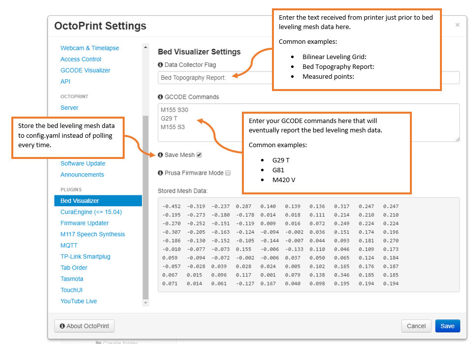

# OctoPrint-BedLevelVisualizer


This plugin utilizes [Plotly](https://plot.ly/plotly-js-scientific-d3-charting-library/) js library to render a 3D surface of the bed's reported mesh on a tab within OctoPrint.

**Note:** If you have Marlin's Auto Temperature Reporting Feature enabled you will want to have M155 S30 and M155 S3 surrounding your G29 command, see settings screenshot, otherwise the collected data will be tainted.

```
Send: G29 T
Recv: echo:Home XYZ first
Recv: 
Recv: Bed Topography Report:
Recv: 
Recv: (0,9)                                                                   (9,9)
Recv: (30,270)                                                                (270,270)
Recv:  -0.452   -0.319   -0.237    0.287    0.140    0.139    0.136    0.317    0.247    0.247
Recv: 
Recv:  -0.195   -0.273   -0.180   -0.178    0.014    0.018    0.111    0.214    0.210    0.210
Recv: 
Recv:  -0.270   -0.252   -0.151   -0.119    0.009    0.016    0.072    0.249    0.224    0.224
Recv: 
Recv:  -0.307   -0.205   -0.163   -0.124   -0.094   -0.002    0.036    0.151    0.174    0.196
Recv: 
Recv:  -0.186   -0.130   -0.152   -0.105   -0.144   -0.007    0.044    0.093    0.181    0.270
Recv: 
Recv:  -0.010   -0.077   -0.073    0.155   -0.006   -0.133    0.110    0.046    0.109    0.173
Recv: 
Recv:   0.059   -0.094   -0.072   -0.002   -0.006    0.037    0.050    0.065    0.124    0.184
Recv: 
Recv:  -0.057   -0.028    0.039    0.028    0.024    0.005    0.102    0.165    0.176    0.187
Recv: 
Recv:   0.067    0.015    0.096    0.117    0.001    0.079    0.138    0.346    0.185    0.185
Recv: 
Recv: [ 0.071]   0.014    0.061   -0.127    0.167    0.040    0.098    0.195    0.194    0.194
Recv: (30,30)                                                                    (270,30)
Recv: (0,0)                                                                     (9,0)
Recv: ok P15 B3
```

## Settings



## Setup

Install via the bundled [Plugin Manager](https://github.com/foosel/OctoPrint/wiki/Plugin:-Plugin-Manager)
or manually using this URL:

    https://github.com/jneilliii/OctoPrint-BedLevelVisualizer/archive/master.zip

## Changelog

**[0.0.8]** (04/22/2018)

**Added**
  - Pop-up notification on error.

**Changed**
  - Removed placeholder attribute on  Data Collector Flag to make it more obvious there's nothing typed in it.

**Fixed**
  - Delta printers not collecting mesh data points.

**[0.0.7]** (04/20/218)

**Changed**
  - Description in Plugin Manager.

**[0.0.6]** (04/19/2018)

**Added**
  - Timestamp stored with saved mesh data.  Displays on mouse hover of info graphic on update button.
  
**Changed**
  - Screenshots updated to make settings a little clearer.
  - Visibility bindings fixed for issues related to new installs and no stored data.

**[0.0.5]** (04/18/2018)

**Added**
  - Prusa Firmware Mode setting, to handle G81 responses correctly

**Changed**
  - Graph is now always visible in OctoPrint as long as you have saving enabled, there is a mesh stored, and the user is logged in.

**Fixed**
  - Remove duplicated tabs from Prusa firmware's G81 response.

**[0.0.4]** (04/17/2018)

**Changed**
  - "Data Collector Flag" is now a text field in lieu of select list to allow full customization of the text that flags for mesh data collection to handle the numerous available options that apparently seem to be out there.

**[0.0.3]** (04/17/2018)

**Added**
  - Capture data option for identifying correct response to start storing mesh data
  - Stored data displayed in settings
  - Non-UBL support

**[0.0.2]** (04/15/2018)

**Added**
  - Settings dialog to update the GCODE command used to report bed topology.
  - Improved performance with option for storing the mesh in config.yaml (default).

**Fixed**
  - Reversed point order to fix graphing misorientation.
	
**[0.0.1]** (04/14/2018)

**Initial Release**

[0.0.8]: https://github.com/jneilliii/OctoPrint-BedLevelVisualizer/tree/0.0.8
[0.0.7]: https://github.com/jneilliii/OctoPrint-BedLevelVisualizer/tree/0.0.7
[0.0.6]: https://github.com/jneilliii/OctoPrint-BedLevelVisualizer/tree/0.0.6
[0.0.5]: https://github.com/jneilliii/OctoPrint-BedLevelVisualizer/tree/0.0.5
[0.0.4]: https://github.com/jneilliii/OctoPrint-BedLevelVisualizer/tree/0.0.4
[0.0.3]: https://github.com/jneilliii/OctoPrint-BedLevelVisualizer/tree/0.0.3
[0.0.2]: https://github.com/jneilliii/OctoPrint-BedLevelVisualizer/tree/0.0.2
[0.0.1]: https://github.com/jneilliii/OctoPrint-BedLevelVisualizer/tree/0.0.1

## To-Do
- [ ] Pause standard OctoPrint temperature polling or squash the responses until processing is completed.
- [ ] Orientation testing to verify axes are in correct direction.
- [ ] Calculate bed dimensions and apply to probe points for display on graph, #28.