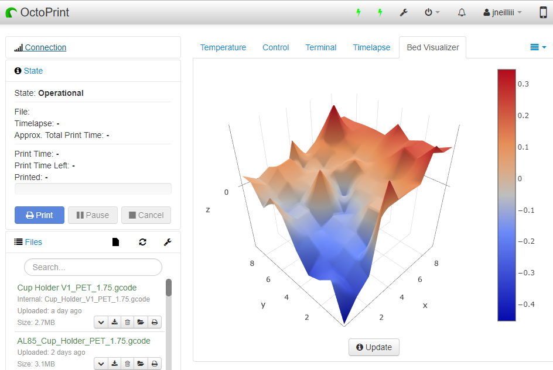

# OctoPrint-BedLevelVisualizer

This plugin visualises the output from various firmware that support bed mesh leveling, noteably the Prusa `G81` mesh leveling report and the Marlin `G29 T` bed topography report. Please note that in order to use this plugin your 3D printer needs to support bed mesh leveling in software or come equipped with an auto level sensor supported by the printer's firmware (some entry-level printers do not provide such support per default). The plugin utilizes [Plotly](https://plot.ly/plotly-js-scientific-d3-charting-library/) js library to render a 3D surface of the bed's reported mesh on a tab within OctoPrint.

## Supported Firmware:

- Marlin
- PrusaFirmware
- Klipper
- Smoothieware

## Example

It converts this:

```
Send: G29 T
Recv: echo:Home XYZ first
Recv:
Recv: Bed Topography Report:
Recv:
Recv: (0,9)                                                                   (9,9)
Recv: (30,270)                                                                (270,270)
Recv:  -0.452   -0.319   -0.237    0.287    0.140    0.139    0.136    0.317    0.247    0.247
Recv:
Recv:  -0.195   -0.273   -0.180   -0.178    0.014    0.018    0.111    0.214    0.210    0.210
Recv:
Recv:  -0.270   -0.252   -0.151   -0.119    0.009    0.016    0.072    0.249    0.224    0.224
Recv:
Recv:  -0.307   -0.205   -0.163   -0.124   -0.094   -0.002    0.036    0.151    0.174    0.196
Recv:
Recv:  -0.186   -0.130   -0.152   -0.105   -0.144   -0.007    0.044    0.093    0.181    0.270
Recv:
Recv:  -0.010   -0.077   -0.073    0.155   -0.006   -0.133    0.110    0.046    0.109    0.173
Recv:
Recv:   0.059   -0.094   -0.072   -0.002   -0.006    0.037    0.050    0.065    0.124    0.184
Recv:
Recv:  -0.057   -0.028    0.039    0.028    0.024    0.005    0.102    0.165    0.176    0.187
Recv:
Recv:   0.067    0.015    0.096    0.117    0.001    0.079    0.138    0.346    0.185    0.185
Recv:
Recv: [ 0.071]   0.014    0.061   -0.127    0.167    0.040    0.098    0.195    0.194    0.194
Recv: (30,30)                                                                    (270,30)
Recv: (0,0)                                                                     (9,0)
Recv: ok P15 B3
```

into this



---

## [Wiki](wiki/index.md)

For more info, see the [wiki](wiki/index.md)

---

## Known Issues

- ~~Install will fail silently in Python 3 due to missing system dependencies. You may have to SSH to your pi and run the command `sudo apt install libatlas3-base` to get the plugin to load.~~ Since version 1.1.0 the plugin no longer has a dependency on numpy.
- ~~If installing on lower memory machines like the Orange Pi Zero or Raspberry Pi A numpy will have issues compiling. Check the instructions [here](https://github.com/jneilliii/OctoPrint-BedLevelVisualizer/issues/141#issuecomment-542227338) for a potential solution.~~ Since version 1.1.0 the plugin no longer has a dependency on numpy.
- System Command Editor and Custom Control Editor plugins have a known issue [here](https://github.com/jneilliii/OctoPrint-BedLevelVisualizer/issues/228) and [here](https://github.com/jneilliii/OctoPrint-BedLevelVisualizer/issues/244) where your customizations for those plugins get wiped when used in conjunction with Bed Level Visualizer and a few other plugins. To avoid this from happening to you disable Bed Level Visualizer and after restarting OctoPrint configure your customizations in those plugins and save. Immediately disable those plugins and re-enable Bed Level Visualizer restart OctoPrint and Reload. Your customizations to controls and the system menu will still remain and the bug that exists in those plugins will be prevented from clearing your customizations. I highly recommend you take regular backups as well.
- ~~Since version 0.1.3 there is a python dependency on numpy. As a result; if you don't already have numpy the install can take in excess of 30 minutes to complete on a pi. Just be patient and let it run and eventually the plugin install will finish.~~ Since version 1.1.0 the plugin no longer has a dependency on numpy.
- If you have Marlin's Auto Temperature Reporting Feature enabled you will want to have M155 S30 and M155 S3 surrounding your G29 command, see settings screenshot, otherwise the collected data could be tainted. Use a value for the first M155 command that is long enough for the probing process to complete.

---

## Most recent changelog
**[1.1.0](https://github.com/jneilliii/OctoPrint-BedLevelVisualizer/releases/tag/1.1.0)** (07/31/2021)

**Added**
* added BLVPROCESSINGON/BLVPROCESSINGOFF received gcode commands via M118, #447. 

The following example custom command button would change to "processing" mode, heat the hot end until it reaches 200 degrees and then turn "processing" mode off. If webcam is enabled while processing the webcam will be shown while in "processing" mode.
```
M118 BLVPROCESSINGON
M109 S200
M118 BLVPROCESSINGOFF
```
* add custom action command `BEDLEVELVISUALIZER_LEVELBED` to allow use with various custom config input options in Marlin (Configurationa_adv.h), ie `CUSTOM_MENU_MAIN`. Will initiate the command contained within the Update Mesh gcode script when received. Requires HOST_ACTION_COMMANDS to be enabled as well. Example menu item.

```
#define MAIN_MENU_ITEM_1_DESC "Bed Visualize"
#define MAIN_MENU_ITEM_1_GCODE "M118 A1 action:BEDLEVELVISUALIZER_LEVELBED"
```
* camera position option

**Updated**
* Plotly js library to version 2.3.1 gl3d bundle

**Fixed**
* resolve issues related to blank date locale string


## [All releases](https://github.com/jneilliii/OctoPrint-BedLevelVisualizer/releases)

---

## To-Do
- [ ] improve old marlin makergear support
- [x] improve rectangular mesh for circular bed calculations
- [x] ~~Pause standard OctoPrint temperature polling or squash the responses until processing is completed.~~ won't be possible, utilize M155 gcode if possible
- [x] ~~Orientation testing to verify axes are in correct direction.~~ added settings to allow controlling the orientation.
- [x] ~~Calculate bed dimensions and apply to probe points for display on graph, #28.~~

---

## Get Help

If you experience issues with this plugin or need assistance please use the issue tracker by clicking issues above.

## Additional Plugins

Check out my other plugins [here](https://plugins.octoprint.org/by_author/#jneilliii)

---

## Sponsors
- Andreas Lindermayr
- [@Mearman](https://github.com/Mearman)
- [@TxBillbr](https://github.com/TxBillbr)
- Gerald Dachs
- [@TheTuxKeeper](https://github.com/thetuxkeeper)
- @tideline3d
- [SimplyPrint](https://simplyprint.dk/)
- [Andrew Beeman](https://github.com/Kiendeleo)
- [Calanish](https://github.com/calanish)
- [Will O](https://github.com/4wrxb)
- [Lachlan Bell](https://lachy.io/)

## Support My Efforts
I, jneilliii, programmed this plugin for fun and do my best effort to support those that have issues with it, please return the favor and leave me a tip or become a Patron if you find this plugin helpful and want me to continue future development.

[](https://www.patreon.com/jneilliii) [](https://paypal.me/jneilliii)

<small>No paypal.me? Send funds via PayPal to jneilliii&#64;gmail&#46;com

You can use [this](https://www.paypal.com/cgi-bin/webscr?cmd=_xclick&business=jneilliii@gmail.com) link too. But the normal PayPal fee will be deducted.
</small>
