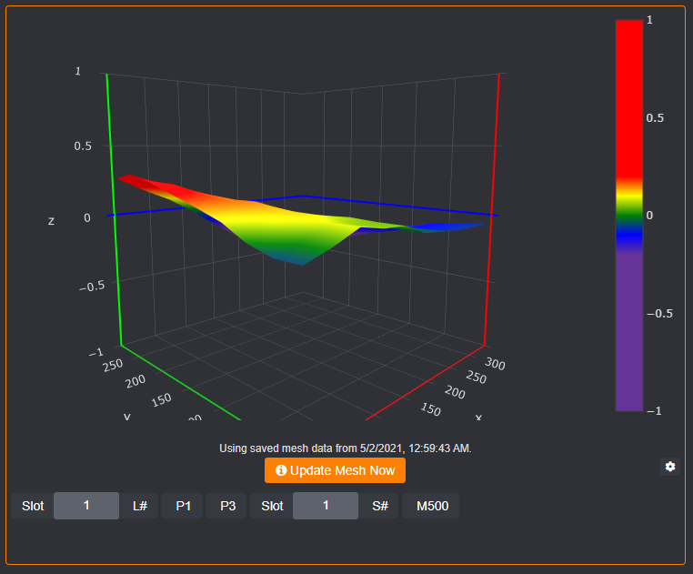
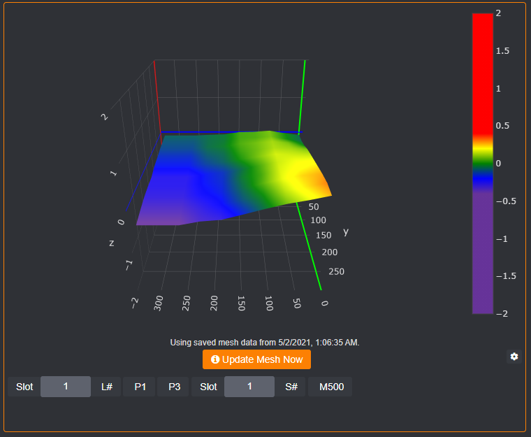
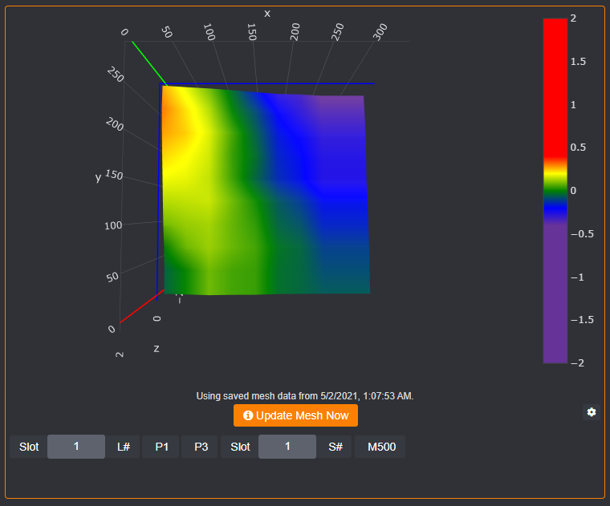

# Camera Positions

Plotly camera positions are strange, as they are not based on the graphed area for positioning. To find out more information about camera positions in Plotly check out the python documentation [here](https://plotly.com/python/3d-camera-controls/) as it gives the best explanation. The Plotly.js library works the same way, it's just not described in detail. The `Camera Postition` setting in the Bed Level Visualizer plugin specifically controls the eye parameter. 

In the documentation linked above and demonstrated in commonly requested configuration examples below you can find what to put in the `Camera Position` setting.

## Default Setting

`-1.25,-1.25,0.25`

## Origin Back Right

`0,2,1`

## From Above

`0,-0.1,2`

