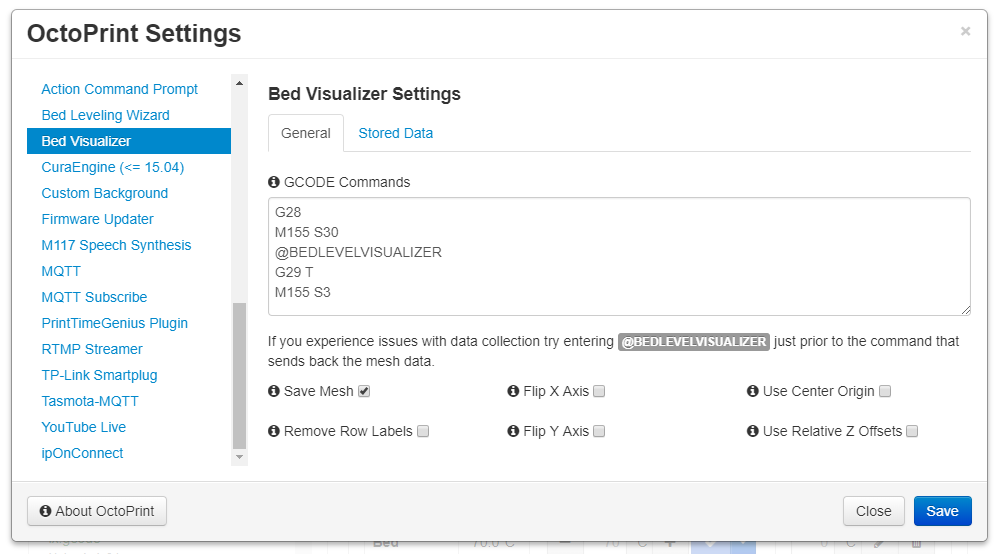

# Welcome to the OctoPrint-BedLevelVisualizer wiki!


## Settings




## Tips
  - If your leveling method requires homing first make sure to enter that as well in the GCODE Commands setting.
  - If you have Marlin's Auto Temperature Reporting feature enabled you will want to have M155 S30 and M155 S3 surrounding your reporting GCODE command, otherwise the collected data will be tainted with temperature information.
  - If you end up requiring multiple commands it is recommended to enter `@BEDLEVELVISUALIZER` just prior to the reporting command.

## Setup

Install via the bundled [Plugin Manager](https://github.com/foosel/OctoPrint/wiki/Plugin:-Plugin-Manager)
or manually using this URL:

```
https://github.com/jneilliii/OctoPrint-BedLevelVisualizer/archive/master.zip
```
OctoPi users can user this command for manually terminal isntall
```
~/oprint/bin/pip install -U "https://github.com/jneilliii/OctoPrint-BedLevelVisualizer/archive/master.zip"

```

## [Mesh Update Process GCODE](gcode-examples.md)

### Example GCODE
For Marlin, Klipper and Prusa mesh update GCODE, please see [here](gcode-examples.md)


---

## [Camera Positions]{camera-positions.md}

### Screenshot of example Camera Posisions
For a couple of examples of different camera positions and how they look, please see [here](camera-positions.md)

## Custom commands
### Parameters
For inserting a custom code paremeter GCODE command, the plus button beside the parameter can be used, or the following syntax can be used:
```
%(parameter_name)s
```
#### Example
For creating a preheating command, after creating a parameter called `bed_temp` with a default value of 60, the custom command including parameter would look like this:
```
M140 S%(bed_temp)s
```